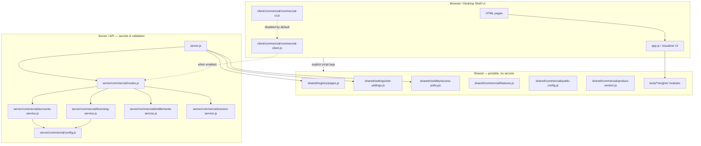

# Okami Designs — Commercial Architecture

This document describes how the codebase separates **frontend UI**, **shared calculation modules**, and **server/API-ready business logic** for web and paid desktop distribution.

**Phase 0 baseline:** Commercial features are **disabled by default**. Tools run normally without licensing or gating. See `docs/PHASE-0-GATE.md` for acceptance tests and the `pre-commercial-phase-1` checkpoint tag.

## Layer overview

## Directory roles

| Path | Role |
|------|------|
| `tools/signal-lab/app.js` | Signal Lab UI only — DOM, controls, preview wiring |
| `tools/signal-lab/engine/` | Portable render/canvas/math (usable in desktop shell) |
| `tools/signal-lab/modules/` | Pattern modules (pure logic + minimal UI hooks) |
| `tools/led-wall-calculator/` | LED wall math (shared calculations) |
| `tools/led-wall-visualizer.js` | LED calculator browser UI |
| `shared/` | Cross-platform modules (Node + browser via IIFE / `require`) |
| `client/commercial/` | Browser stubs — fetch API, legal footer, upgrade placeholders (**off by default**) |
| `server/commercial/` | Licensing, accounts, entitlements, version checks |
| `legal/` | Terms, privacy, disclaimer, commercial license placeholders |
| `scripts/phase-0-acceptance.mjs` | Automated Phase 0 gate tests |

## What stays out of the browser

- License API keys and validation (`OKAMI_LICENSE_API_KEY`, `server/commercial/config.js`)
- Session secrets (`OKAMI_SESSION_SECRET`)
- License verification logic (`server/commercial/licensing-service.js`)
- Entitlement resolution (`server/commercial/entitlements-service.js`)

The browser only calls `/api/commercial/*` when commercial is enabled, and receives **already-resolved** entitlements (feature flags, tier). It must not embed license keys or implement validation.

## Commercial API (placeholders)

| Endpoint | Purpose |
|----------|---------|
| `GET /api/commercial/config` | Public product metadata, legal links, feature keys |
| `GET /api/commercial/entitlements?productId=` | Resolved tier + feature map for UI gating |
| `POST /api/commercial/entitlements` | Activate with license key (server validates) |
| `GET /api/commercial/account/session` | Signed-in user profile stub |
| `POST /api/commercial/license/verify` | Server-side license check |
| `GET /api/commercial/version` | Update availability for web/desktop |

When `OKAMI_COMMERCIAL_ENABLED` is not `true`, the server returns **all features** (development mode) and the client uses local mocks without network calls.

Enable production commercial behavior with `OKAMI_COMMERCIAL_ENABLED=true`, client `COMMERCIAL_ENABLED = true`, and `.env` configured (see `.env.example`).

## Browser bootstrap

Each public HTML page loads shared modules via **explicit `<script>` tags** (root vs `../` prefix on tool pages), then:

1. `shared/settings/site-settings.js`
2. `shared/registry/pages.js`
3. `shared/visibility/access-policy.js`
4. `page-registry.js` (shim — validates registry loaded)
5. `site-visibility.js`

Commercial client/UI scripts are **not** loaded on tool pages by default. They live in `client/commercial/` and are opt-in when Phase 4 begins.

SPA navigation (`script.js`) skips re-loading bootstrap and shared scripts on client-side page changes.

## Desktop packaging notes

- Reuse `shared/` and tool `engine/` / calculator modules inside Electron/Tauri.
- Point the desktop shell at the same `/api/commercial` endpoints (or embed a local Node sidecar using `server/commercial/`).
- Run version checks via `OkamiCommercialClient.checkVersion('desktop', currentVersion)`.
- Never ship `.env` or API keys in the desktop bundle; use OS secure storage for user license tokens returned by the server.

## Signal Lab

See `tools/signal-lab/ARCHITECTURE.md` for tool-specific UI vs engine boundaries.

## Legal pages

Replace placeholder content in `legal/*.html` with counsel-approved copy before launch. Links are centralized in `shared/commercial/public-config.js` (`LEGAL_LINKS`).
